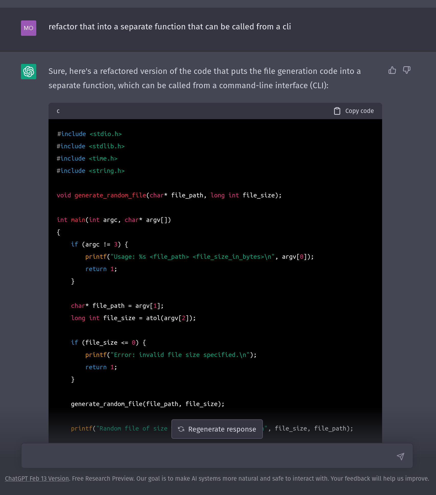
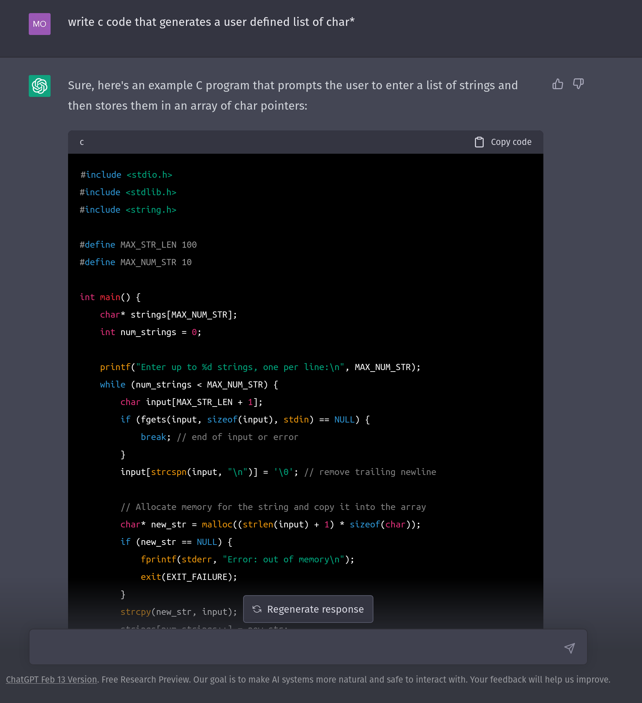

# chatgpt

## Writing large numbers of files

I needed to write a bunch of test files in a known dir structure


```
#include <stdio.h>
#include <stdlib.h>
#include <time.h>

int main()
{
    char* file_name = "random_file.bin";
    char* file_path = "/path/to/file/random_file.bin";
    long int file_size = 5 * 1024 * 1024; // 5 megabytes

    FILE* fp = fopen(file_path, "wb");

    if (fp == NULL) {
        printf("Error: could not open file for writing.");
        return 1;
    }

    srand(time(NULL));

    char* buffer = (char*)malloc(file_size);

    for (long int i = 0; i < file_size; i++) {
        buffer[i] = (char)(rand() % 256);
    }

    fwrite(buffer, 1, file_size, fp);

    fclose(fp);

    free(buffer);

    printf("Random file of size %ld bytes written to %s.\n", file_size, file_path);

    return 0;
}
```

Refactor with a single natural language command .. wow!


```
#include <stdio.h>
#include <stdlib.h>
#include <time.h>
#include <string.h>

void generate_random_file(char* file_path, long int file_size);

int main(int argc, char* argv[])
{
    if (argc != 3) {
        printf("Usage: %s <file_path> <file_size_in_bytes>\n", argv[0]);
        return 1;
    }

    char* file_path = argv[1];
    long int file_size = atol(argv[2]);

    if (file_size <= 0) {
        printf("Error: invalid file size specified.\n");
        return 1;
    }

    generate_random_file(file_path, file_size);

    printf("Random file of size %ld bytes written to %s.\n", file_size, file_path);

    return 0;
}

void generate_random_file(char* file_path, long int file_size)
{
    FILE* fp = fopen(file_path, "wb");

    if (fp == NULL) {
        printf("Error: could not open file for writing.");
        exit(1);
    }

    srand(time(NULL));

    char* buffer = (char*)malloc(file_size);

    for (long int i = 0; i < file_size; i++) {
        buffer[i] = (char)(rand() % 256);
    }

    fwrite(buffer, 1, file_size, fp);

    fclose(fp);

    free(buffer);
}
```
## char * arrays

I needed to dynamically grow a list of strings to hold a variable number of playlists for my sonos controller. 
I could not figure out the syntax to do this.


```
#include <stdio.h>
#include <stdlib.h>
#include <string.h>

#define MAX_STR_LEN 100
#define MAX_NUM_STR 10

int main() {
    char* strings[MAX_NUM_STR];
    int num_strings = 0;

    printf("Enter up to %d strings, one per line:\n", MAX_NUM_STR);
    while (num_strings < MAX_NUM_STR) {
        char input[MAX_STR_LEN + 1];
        if (fgets(input, sizeof(input), stdin) == NULL) {
            break; // end of input or error
        }
        input[strcspn(input, "\n")] = '\0'; // remove trailing newline

        // Allocate memory for the string and copy it into the array
        char* new_str = malloc((strlen(input) + 1) * sizeof(char));
        if (new_str == NULL) {
            fprintf(stderr, "Error: out of memory\n");
            exit(EXIT_FAILURE);
        }
        strcpy(new_str, input);
        strings[num_strings++] = new_str;
    }

    // Print the strings
    printf("You entered %d strings:\n", num_strings);
    for (int i = 0; i < num_strings; i++) {
        printf("%s\n", strings[i]);
    }

    // Free the memory used by the strings
    for (int i = 0; i < num_strings; i++) {
        free(strings[i]);
    }

    return 0;
}


```

```
#include <stdio.h>
#include <stdlib.h>
#include <string.h>

#define MAX_STR_LEN 100

int main() {
    char** strings = NULL;
    int num_strings = 0;
    int max_num_strings = 10;

    printf("Enter up to %d strings, one per line (or enter a blank line to stop):\n", max_num_strings);
    while (1) {
        char input[MAX_STR_LEN + 1];
        if (fgets(input, sizeof(input), stdin) == NULL || num_strings >= max_num_strings) {
            break; // end of input, error, or maximum number of strings reached
        }
        input[strcspn(input, "\n")] = '\0'; // remove trailing newline
        if (input[0] == '\0') {
            break; // blank line entered
        }

        // Allocate memory for the string and copy it into the array
        char* new_str = malloc((strlen(input) + 1) * sizeof(char));
        if (new_str == NULL) {
            fprintf(stderr, "Error: out of memory\n");
            exit(EXIT_FAILURE);
        }
        strcpy(new_str, input);

        // Reallocate the strings array if needed
        if (num_strings >= max_num_strings) {
            max_num_strings *= 2;
            char** new_strings = realloc(strings, max_num_strings * sizeof(char*));
            if (new_strings == NULL) {
                fprintf(stderr, "Error: out of memory\n");
                exit(EXIT_FAILURE);
            }
            strings = new_strings;
        }

        // Add the new string to the array
        strings[num_strings++] = new_str;
    }

    // Print the strings
    printf("You entered %d strings:\n", num_strings);
    for (int i = 0; i < num_strings; i++) {
        printf("%s\n", strings[i]);
    }

    // Free the memory used by the strings
    for (int i = 0; i < num_strings; i++) {
        free(strings[i]);
    }
    free(strings);

    return 0;
}


```

Final explanation:
```
In this version of the program, strings is initially set to NULL, indicating that it doesn't yet point to any memory. As strings are entered by the user, the program dynami
cally allocates memory using realloc() to increase the size of the strings array if necessary. The maximum number of strings max_num_strings is initially set to 10, but it 
can be increased as needed by doubling its value each time the array needs to be reallocated.

After all the strings have been entered, the program prints them out and then frees the memory used by each string and the strings array itself using free().
``` 